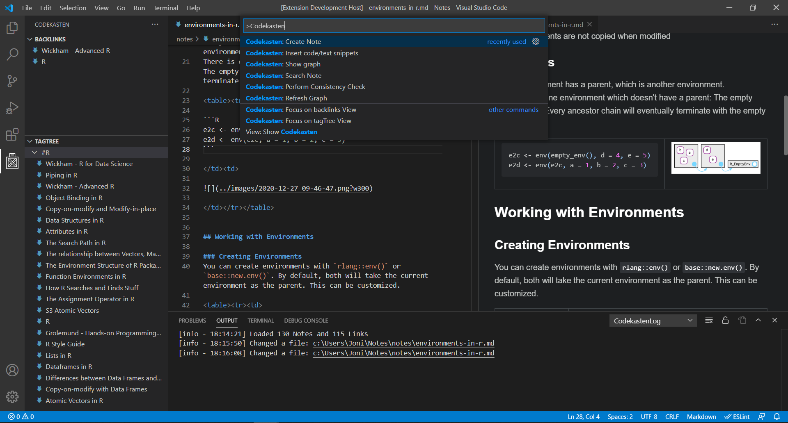

# Codekasten: Advanced Zettelkasten for VS Code

The Codekasten extensions provides tools and shortcuts to manage a _Zettelkasten_ in VS Code. 
If you don't know what a Zettelkasten is, there are many resources on the web. [Here](http://evantravers.com/articles/2020/03/13/simple-markdown-zettelkasten/) is a good place to start.

> ⚠️ Warning: This extension is made to suite my personal workflow.      
> ⚠️ Use at your own risk and always make sure to backup your notes. 

## Recommended Extensions
To harness the full power of markdown documents in VS Code, [Markdown Preview Enhanced](https://marketplace.visualstudio.com/items?itemName=shd101wyy.markdown-preview-enhanced) is recommended.    
For easy insertion of images, use [Paste Image](https://marketplace.visualstudio.com/items?itemName=mushan.vscode-paste-image). Note that this extension is not maintained anymore, but forks do exists. 

## Features
Currently supported:
- Easily create new Notes:
    - Based on user-supplied templates
    - Selected text can be used to pre-fill the templates
    - Automatically create daily notes
- Search for notes and insert them as links
- See the notes that link to the currently open node in the left sidebar
- See the notes that share tags with the currently open node, also in the left sidebar
- Graph visualization:
  - Get to the point: Only show the note you are currently working with and its immediate neighborhood
  - Sort by cluster size to find small, unconnected notes
  - Structure notes (with tag `#structure`) are supported
- HTML snippets for features that are not supported in markdown (e.g. more control over tables)
- Consistency Checks: Find stubs and unlinked images

## Setup and Extension Settings
There are no changeable settings in VS Code. 
When creating a new note, the extension expects a folder `.codekasten/templates`, containing templates as `.md` files.

### Customizing Recommended Extensions
Unfortunately, basic markdown does not allow to apply styling to images. However, you can attach CSS Selectors to images URIs ([source](https://www.xaprb.com/blog/how-to-style-images-with-markdown/)). Markdown Preview Enhanced provides a custom CSS file that is applied to all your files. It can be edited by using `Ctrl + Shift + P` to run `Markdown Preview Enhanced: Customize CSS`.

For my personal workflow, I sometimes want to resize images. This can be done by writing the following markdown:
`, which might be cool and also help with debugging.

## Release Notes

### 0.1.1
Date: 2021-01-17  
New Features:
- Scripts for consistency checks
- Quick insertion of HTML snippets and often used symbols
- Support for styling images and markdown-compatible HTML tables

Bugfixes:
- No more triple-hyphens when suggesting a filename (e.g. the suggested filename for `Author - Title` would have been `author---title.md`)
- Searching for tags is now case-insensitive
- When automatically replacing text in files, all occurences are replaced

### 0.1.0
Date: 2020-12-18  
New Features:
- Create new notes
- Search for notes and insert them as links
- See backlinks and notes with shared tags in the left sidebar
- Graph visualization

## Attributions
Many ideas and some code snippets are inspired by [foam](https://github.com/foambubble/), a VS Code extension with a similar use case. 